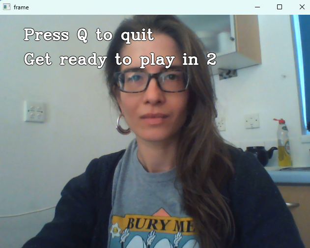

# Computer Vision RPS

Rock-Paper-Scissors is a game in which each player simultaneously shows one of three hand signals representing rock, paper, or scissors. Rock beats scissors. Scissors beats paper. Paper beats rock. The player who shows the first option that beats the other player's option wins. This is an implementation of an interactive Rock-Paper-Scissors game, in which the user can play with the computer using the camera.

## Milestone 1

Set up GitHub repo.

## Milestone 2

- Trained a computer vision model from Google Teachable Machine to classify hand gestures as "Rock", "Paper", "Scissors", or "Nothing". Downloaded model (keras_model.h5) and labels (labels.txt).
- The model will be used to classify the user's hand gestures (read via webcam) and play a game of Rock, Paper, Scissors against the computer.

## Milestone 3

Created a new Conda virtual environment. Installed the following dependencies:
- opencv-python
- tensorflow
- ipykernel

## Milestone 4

Implemented functions for manual gameplay.
- __get_computer_choice()__ randomly selects an option from "Rock", "Paper", or "Scissors".
- __get_user_choice()__ asks user to input "Rock", "Paper" or "Scissors" via the console. Input is stripped, capitalized, and validated via a while loop.
- __get_winner()__ compares the output of get_user_choice() and get_user_choice() to determine who won the game, then prints a message to the console.
- __play()__ executes the gameplay by calling get_user_choice(), get_computer_choice, and get_winner().

## Milestone 5
 
- Refactored the code and replaced the hard-coded user guess with output from the computer vision model.
- Created RockPaperScissors class to read user input from webcam and execute gameplay, and KerasModel class to classify user input as "Rock", "Paper", "Scissors", or "Nothing". The game continues until one player (computer or user) has achieved a predetermined number of wins. A countdown is displayed between rounds. Outcome of each game is displayed on the video capture screen. White text with a black border is used to improve visibility.
- The constructor of the RockPaperScissors class instantiates a KerasModel object, then passes images (captured via webcam) to the model for classification. The model returns an array of probabilities for each class. In the interests of reducing false positives, an image will only be classified as "Rock", "Paper", or "Scissors" if the probability is >= 50%.
- Screenshots of gameplay are shown below. 
- The game could have been improved if I'd spent more time training the model. The current model is biased towards "Scissors" and often misclassifies hand gestures.

## Screenshots of gameplay

Countdown timer

Game play: no user gesture detected

Game play: user gesture detected

End of game
