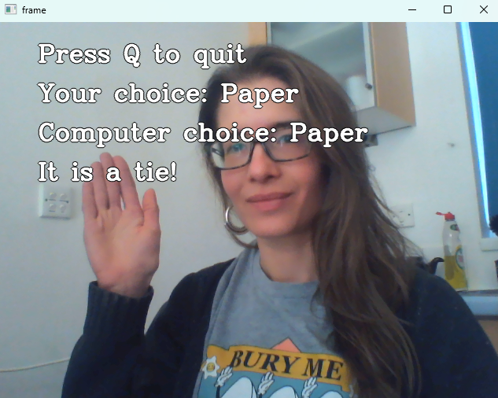

# Computer Vision Rock-Paper-Scissors

## Table of Contents

1. [Description](#description)

1. [Installation instructions](#installation-instructions)

1. [Usage instructions](#usage-instructions)

1. [File structure](#file-structure)

1. [License information](#license-information)

## Description

This project is the Computer Vision Rock-Paper-Scissors game for AiCore. Rock-Paper-Scissors is a game in which each player simultaneously shows one of three hand signals representing rock, paper, or scissors. Rock beats scissors. Scissors beats paper. Paper beats rock. The player who shows the first option that beats the other player's option wins. This is an implementation of an interactive Rock-Paper-Scissors game, in which the user can play with the computer using the camera.

NB: The game could have been improved if I had spent more time training the model. The current model is biased towards "Scissors" and often misclassifies hand gestures.

## Installation instructions

- Train a computer vision model from Google Teachable machine to classify hand gestures as "Rock", "Paper", "Scissors", or "Nothing". Download the model (keras_model.h5) and labels (labels.txt). The model will be used to classify the player's hand gestures (read via webcam) and play a game of Rock, Paper, Scissors against the computer.
- Install the following dependencies: 
    - opencv-python
    - tensorflow
    - ipykernel


## Usage instructions
 
- Once all dependencies have been installed, run __camera_rps.py__. A window with gameplay instructions will pop up. 
- Press "Q" to quit at any time.
- Screenshots to illustrate gameplay are shown below. 

__Countdown timer__
<br>


<br>

__No user gesture detected in current round__
<br>

<br>

__User gesture detected in current round__
<br>


<br>

__End of game__
<br>


## File structure

```
├── camera_rps.py
├── keras_model.h5
├── labels.txt
├── LICENSE
├── README.md
├── requirements.txt
└── screenshots
    ├── rps_screenshot_01a.png
    ├── rps_screenshot_01b.png
    ├── rps_screenshot_01c.png
    ├── rps_screenshot_02.png
    ├── rps_screenshot_03a.png
    ├── rps_screenshot_03b.png
    └── rps_screenshot_04.png
```

## License information

[](https://opensource.org/licenses/MIT)